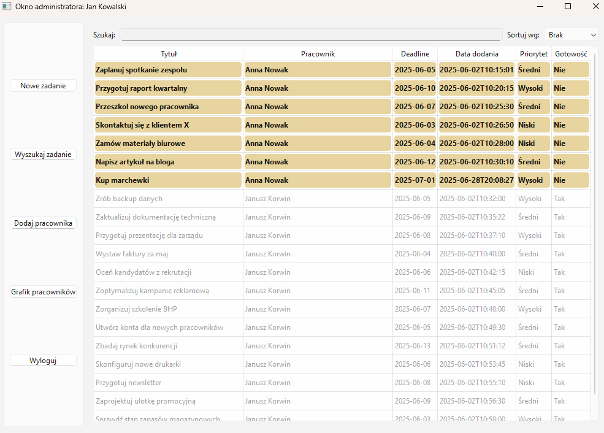
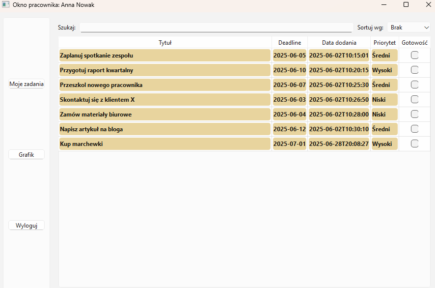

# 🧩 Task Manager — Employee and Task Management System

## 📖 Project Overview

**Task Manager** is a desktop application built in **C++ / Qt 6.9.0** for managing employees and their assigned tasks.  
It’s designed as a realistic team management system, featuring two perspectives — **Administrator** and **Employee** — within a clean and intuitive GUI.

The system demonstrates solid programming principles, file-based data persistence, and the use of software design patterns.

---

## 👤 User Roles

### 👨‍💼 Administrator
- Full control over tasks and employees.  
- Can view, add, assign, and manage work schedules.

### 👷 Employee
- Sees only their assigned tasks.  
- Can mark tasks as completed and manage their work availability.

---

## 🚀 Key Features

### 🔐 Login Screen
- Login with credentials for either admin or employee.  
- Example test accounts:
  - **Admin:** `user1` / `pass1`
  - **Employee:** `user2` / `pass2`

---

### 🛠️ Administrator Panel
- **Task List View** – highlights incomplete tasks.  
- **Sorting Options** – by priority, creation date, or deadline.  
- **Task Creation** – manually or via *automatic assignment*, which selects the most suitable employee based on workload.  
- **Employee Management** – add new employees to the system.  
- **Work Schedule Overview** – inspect each employee’s availability.

---

### 👷 Employee Panel
- View **only personal tasks** assigned to the logged-in employee.  
- **Mark tasks as completed.**  
- **Edit availability schedule** for upcoming days.

---

## ⚙️ Technologies Used

- **Language:** C++  
- **Framework:** Qt 6.9.0  
- **IDE:** Visual Studio 2022  
- **Data Storage:** Plain text files (`.txt`)  

---

## ▶️ How to Run the Project (Visual Studio)

1. Open **Visual Studio 2022**.  
2. Choose **Open Project / Solution** and select the `.sln` file.  
3. In project settings, make sure to set:
   - **Qt Version:** `Qt 6.9.0`
   - **Configuration:** `Debug`
4. Press **Run (F5)**.  
5. The application will start and display the login window.

---

## 🖼️ Screenshots

### 🔐 Login Window

### 🛠️ Admin Panel

### 👷 Employee View

